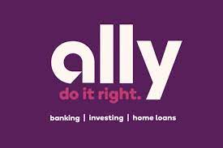

# fintchhw1
# Digital Banking: Ally Financial Inc.

## Overview and Origin

* Name of company: Ally Financial Inc.

* Year company incorporated: 1919

* Founders of the company: General Motors Acceptance Corporation (GMAC) a division of General Motors (GM). 

* Main idea of company: Back in the early 1920s Ally finincial focused on providing car loans right at the dealerships when at that time people usualy purchased a vehicle through cash or securing their own financing from banks that did not typically issue loans for vechicles.  

* Fund: General Motors

## Business Activities:

* Specific financial problems that the comapny is trying to solve: Easily accessible online banking (auto, persaonl loans, credit cards, mortages, investiment and retirement plans)

* Intended customers: money mindful customers, looking for diffrent innoviate ways to manage their money.
* Market size: 11 Million customers
* Solution their company offers that their competitors don't: They focus on putting customer service first, and maintaining competivate rates. They motto of do it right, implements they are focused on success and satifiscation of the communities they are serving. They provided various financial information such as advice and education in various acpects of finance. 

* Technologies currently using: jQuery, PHP, Apache HTTP Serv, Bootsrap, Modernizr, Lodash, Moment.js, Akamai, Adobe Experience

## Landscape:

* Domain of financial industry: Digital Banking

* Major trends and innovations of Digital Banking: easier accessiblitly to banking, tools like mobile banking apps, compared to tradtional banking lower/no fees, cytrocurrency, the abliltity to do many financial activites through mobile devices.

* Other major companies in digital banking: Monzo, Starling Bank, Tandem, Tide, N26, Atom

## Results

* Business impact: Able to provide over millions of people financial solutions at affordable or competetive rates

* Core metrics that companies in this domain use to measure success: Overall usage and satificiation of its customers, and renvue. Allly Financial has doing well as it has reached over 11 million customers as well had been able to give back to the communities and its employees.  

* Performance compared to others: relatively well, as it has been able to branch off from just auto and into various sectors such as investment, personal lending, mortages, and retiremnet plans. 

## Recommendations

* Ally improving its online platforms to be more technology handicapped friendly. By improving its interface or allowing more clear and user friendly nagivations.
* Due to having no physical locations, only digital deposits or other ectronic methods are available to deposit into a checking, saving, or investment accounts, which leads to potential lose of clients who manuever cash. This could require a partnership with another financial insitute or have accessiblity to atms that can acesses these accounts. This would need impletations of online secuirty and technology to be able to preform these tasks. 

## Resources 

* https://stackshare.io/ally/ally-com
* https://www.ally.com/about
* https://www.insiderintelligence.com/insights/fintech-companies-startups/
